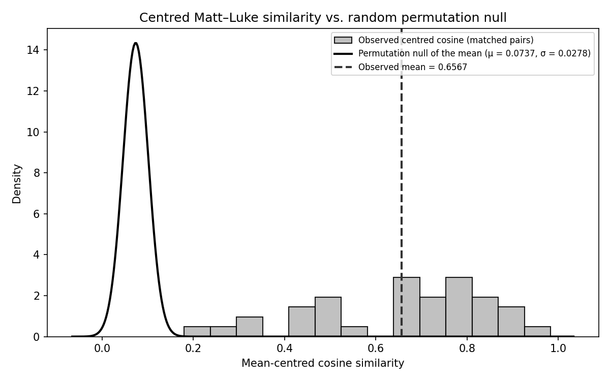

# STCM — Synoptic Transform Calibration Model

> A calibrated source-analysis approach to the Synoptic Problem
> using embedding-space geometry.

[](https://doi.org/10.5281/zenodo.21761951)

📖 **[Documentation & Interactive Results](https://agnieszkachr.github.io/stcm/)**

> [!IMPORTANT]
> **MODEL NOTICE**: This repository uses **`ABeZet/Koine-Greek-BERT`** as the embedding model (replacing the classical Ancient Greek BERT baseline used in early experiments). The register-specific model resolves vocabulary-register issues in the synoptic gospels — notably, the *Beatitudes* (Matt 5:3–12 / Luke 6:20–26) now align with the semantic baseline (raw cosine 0.952, centred rank 14 of 36). All calibration signatures, permutation tests, and downstream outputs were regenerated with the new model.

## Overview

STCM is a computational research tool that investigates the **Synoptic Problem** — the literary relationship among the three synoptic gospels (Matthew, Mark, Luke) — through NLP embedding analysis.

The core hypothesis under test: **do the double-tradition pericopes (passages found in Matthew and Luke but absent from Mark) exhibit an embedding-space signature consistent with derivation from a shared written source (the hypothetical Q document)?**

### Method

1. **Calibration** — Embed triple-tradition pericopes (Matt + Mark + Luke) with [Koine-Greek-BERT](https://huggingface.co/ABeZet/Koine-Greek-BERT). Compute cosine similarity distributions (Signature A) and residual-vector correlations (Signature B) to establish baselines for known source-sharing.

2. **Scoring** — For each double-tradition pericope, compute the Matt–Luke similarity statistics. The primary statistic for both inference and ranking is the **mean-centred cosine similarity** (anisotropy-corrected); the raw cosine and the residual correlation are analysed in parallel. (A legacy composite index remains available in the pipeline outputs for backward compatibility but is not used for inference or ranking.)

3. **Reconstruction** — Estimate latent Q embeddings via iterative, ridge-regularised centroid-shrinkage convergence.

4. **Evaluation** — Random and thematic-null permutation tests on the centred cosine, the raw cosine, and the residual correlation; sentence-level bootstrap robustness; word-overlap baseline comparison; Goulder redaction test; directionality inference (bootstrap CI + sign-flip permutation test); and internal BERT validation on known NT paraphrases.

5. **Confound and advanced analyses** — Passage length, literary form, and compositional-stratum analyses with the article figure set (`generate_evaluation_figures.py`); anisotropy correction, genre-floor quantification, directionality inference, and the centred-cosine ranking (`advanced_analysis.py`).

### Key Results

| Metric | Value |
|--------|-------|
| Embedding model | `ABeZet/Koine-Greek-BERT` (DAPT of Ancient-Greek-BERT; corpus incl. LXX, NT, Apostolic Fathers, Hellenistic historians) |
| Triple-tradition calibration (Sig-A) | μ = 0.9472, σ = 0.0321 (95% CI: [0.9376, 0.9561]); centred mean 0.4749 |
| Residual signature (Sig-B) | μ = 0.3693, σ = 0.1972 |
| **Centred cosine (primary statistic)** | matched mean 0.6567 (SD 0.1981) vs unrelated-pair floor 0.0589; random null 0.0737 (SD 0.0278), *z* = 20.98; thematic null 0.1164 (SD 0.0213), *z* = 25.37; both *p* < 0.001 |
| Raw-cosine permutation tests (concordant) | observed 0.9452 vs random null 0.8533 (SD 0.0044), *z* = 20.66; thematic null 0.8585 (SD 0.0048), *z* = 18.01; both *p* < 0.001 |
| Residual genre floor | matched 0.7166 vs mismatched floor 0.2290; *z* = 21.27 / 22.64; *p* < 0.001 |
| Sentence-level bootstrap SD (centred) | 0.1309 (range of statistic: [0.1799, 0.9833]) |
| Word-overlap Pearson r (centred) | 0.770 (~41% variance unexplained) |
| Goulder redaction test (centred) | Welch's *t* = −1.177, *p* = 0.261, *d* = −0.523 (inconclusive, underpowered) |
| Directionality | Δ*R*² = +0.030 (L\|M 0.163 vs M\|L 0.133); 95% bootstrap CI [−0.004, +0.035]; sign-flip *p* = 0.102 — **no significant asymmetry**; residual norms 0.4453 vs 0.4058, Wilcoxon *p* < 0.001 |
| Reconstruction convergence | 100% |

**Top 5 pericopes by centred cosine:**

1. Serving Two Masters (0.9833)
2. Lament over Jerusalem (0.9150)
3. Return of Unclean Spirit (0.8869)
4. Lamp of the Body (0.8827)
5. Hidden from Wise, Revealed (0.8618)



## Quickstart

```bash
# 1. Clone and enter the repo
cd stcm

# 2. Create venv and install dependencies (uv)
uv venv
uv pip install -r requirements.txt
# (or with pip: pip install -r requirements.txt)

# 3. Download SBLGNT source texts
python download_sblgnt.py

# 4. Run the full pipeline
python run_pipeline.py

# 5. Re-run with evaluation, resuming completed steps
python run_pipeline.py --resume

# 6. Skip evaluation for speed
python run_pipeline.py --skip-eval

# 7. Anisotropy correction, genre floor, directionality, centred ranking
#    (runs from the embedding cache; no model needed when cache is present)
python advanced_analysis.py

# 8. Regenerate the article figures from the centred ranking
python generate_evaluation_figures.py
```

### Output files

```
outputs/
├── figures/
│   ├── q_score_histogram.png          # Legacy pipeline visualisation
│   └── evaluation/fig1–fig6 …         # Article figure set (centred metric)
├── models/
│   ├── calibration_signatures.pkl     # Calibrated signatures
│   └── reconstructed_q_embeddings.pkl
└── reports/
    ├── evaluation_summary.md          # Full evaluation suite results
    ├── advanced_analysis.md           # Anisotropy, genre floor, directionality
    ├── centred_cosine_ranking.csv     # Primary per-pericope ranking (all 36)
    ├── q_score_distribution.csv       # Per-pericope measurements (legacy index incl.)
    └── system_validation.txt          # System report
```

## Architecture

```
stcm/
├── stcm/
│   ├── __init__.py        # Package metadata
│   ├── config.py          # Configuration with env-var overrides
│   ├── utils.py           # Greek normalisation, SBLGNT parsing, math helpers
│   ├── data_loader.py     # SBLGNT loader + Aland pericope alignment table
│   ├── embeddings.py      # Koine-Greek-BERT embedding pipeline with caching
│   ├── calibration.py     # Triple-tradition signature computation
│   ├── scoring.py         # Double-tradition similarity computation
│   ├── reconstruction.py  # Latent Q embedding estimation
│   └── evaluation.py      # Full robustness evaluation suite
├── advanced_analysis.py            # Anisotropy, genre floor, directionality, centred ranking
├── generate_evaluation_figures.py  # Article figures from the centred ranking
├── site/                  # Markdown source files for MkDocs (docs_dir)
├── docs/                  # Generated HTML site for GitHub Pages (site_dir)
├── run_pipeline.py        # End-to-end pipeline runner (resumable)
├── download_sblgnt.py     # SBLGNT data downloader
└── mkdocs.yml             # MkDocs configuration
```

## Configuration

All settings can be overridden via environment variables with the `STCM_` prefix:

```bash
# Use a different embedding model
STCM_EMBEDDING_MODEL=bert-base-multilingual-cased python run_pipeline.py

# Change log level
STCM_LOG_LEVEL=DEBUG python run_pipeline.py
```

Embedding vectors are cached on disk under a key that includes **both** the model identifier and the text, so switching models can never silently reuse vectors produced by a different model. Cache writes are atomic, and the model itself is loaded lazily — a fully cached corpus can be analysed without the model weights (or torch/transformers) installed.

If the transformer model cannot be loaded on a cache miss, the pipeline stops with an error. A deterministic offline n-gram embedder can be enabled for smoke-testing only with `STCM_ALLOW_FALLBACK=1`; its results are **not** comparable to the published outputs, and the embedder actually used is recorded in `system_validation.txt`.

## Methodology

### Signature A — Independent Tradition Baseline

For each triple-tradition pericope (n = 49), we compute `cos(emb(Matt), emb(Luke))`. This yields a distribution of expected Matt–Luke similarities when both evangelists share a common Markan source. The calibrated mean (0.9472) and 95% CI [0.9376, 0.9561] define the expected similarity range; the mean-centred equivalent is 0.4749.

### Signature B — Residual Dependence

The residual of Matthew relative to Mark captures what Matthew *adds* beyond the Markan template. If Matthew and Luke independently used Q in addition to Mark, their residuals should correlate. The calibrated mean residual cosine similarity is 0.3693.

For double-tradition pericopes (where Mark is absent), the residual is computed relative to the **Mark centroid** — the mean embedding of all Mark's triple-tradition pericopes. Because Mark's material is overwhelmingly narrative whilst the double tradition is predominantly discourse, any two discourse passages show correlated displacement against this narrative baseline. This genre-level elevation is **quantified directly** as the mean residual correlation among mismatched pairs (the genre floor, 0.2290); the evidential quantity is the matched-pair excess over that floor (0.7166 − 0.2290 = 0.4876, *p* < 0.001).

### Primary Statistic — Mean-Centred Cosine

Contextual embedding spaces are anisotropic: vectors crowd into a narrow cone, so even unrelated texts show high raw cosine similarity (Ethayarajh 2019). The primary statistic therefore subtracts the corpus mean vector (computed over all 219 pericope embeddings) before computing cosines (cf. Su et al. 2021). Under this correction, unrelated pairs average ≈ 0.06 while correctly paired double-tradition passages average 0.66. The centred cosine carries **all inference and ranking**; it has no tunable parameters. The per-pericope ranking is released as `outputs/reports/centred_cosine_ranking.csv`.

A legacy composite index (0.8 × cosine + 0.2 × max(0, residual)) remains in the pipeline outputs for backward compatibility with earlier versions; it is not used for inference or ranking. The pipeline's weight-sensitivity analysis covering that index (top-5 Jaccard = 0.833 across four schemes) is likewise retained as a legacy diagnostic.

### Reconstruction

Latent Q embeddings are estimated by an iterative, ridge-regularised centroid-shrinkage algorithm. For each pericope, the calibrated residual transforms are stripped from the Matthew and Luke embeddings, and a weighted centroid (including the previous estimate as a shrinkage regulariser) converges to a stable latent position. All 36 pericopes converge within tolerance (1e-6) in ≤ 100 iterations.

## Evaluation Suite

The evaluation module (`stcm/evaluation.py`) and the advanced-analysis script together perform:

1. **Random permutation test** — Tests whether correctly paired Matt–Luke pericopes produce higher similarity statistics than random pairings (1,000 permutations; empirical *p* < 0.001 for the centred cosine, the raw cosine, and the legacy composite alike).
2. **Top-10 permutation test** — As above, for the ten highest-scoring pericopes.
3. **Raw-cosine permutation tests** — Repeats both permutation tests on the mean raw cosine alone.
4. **Thematic-null permutation test** — A more demanding null that pairs each Matthean pericope with a *thematically similar* Lukan pericope (wisdom with wisdom, apocalyptic with apocalyptic, etc.), controlling for the possibility that topical overlap alone inflates similarity. Signal remains significant (empirical *p* < 0.001).
5. **Weight sensitivity analysis (legacy)** — Recomputes the legacy composite under four alternative weighting schemes; reports top-5 Jaccard stability. Retained for backward compatibility; the primary statistic has no weights.
6. **Sentence-level bootstrap** — Resamples sentences within each pericope (200 resamples) to measure robustness to input perturbation.
7. **Word-overlap comparison** — Correlates the centred cosines with word-level Jaccard coefficients to demonstrate that embeddings capture information beyond lexical overlap (*r* = 0.770).
8. **Goulder redaction test** — Compares centred-cosine distributions of pericopes Goulder (1989) identifies as demonstrating Lukan redaction of Matthew against the remainder. The test is underpowered at current sample sizes (*d* = −0.523, *p* = 0.261); the result is genuinely inconclusive.
9. **Directionality inference** — Exact leave-one-out ridge regression (hat-matrix identity) predicting Luke from Matthew and vice versa, with a 95% percentile bootstrap confidence interval and a sign-flip permutation test for the predictability asymmetry. No significant asymmetry is detected at n = 36.
10. **Internal BERT validation** — Tests model calibration on known NT paraphrases (expected high similarity) vs. unrelated passages (expected low similarity); separation = 0.149 in the uncorrected space.

The confound analyses (passage length, literary form, Kloppenborg strata) and the article figure set are produced by `generate_evaluation_figures.py` from the centred ranking. `advanced_analysis.py` provides the anisotropy diagnosis and mean-centred similarity analyses (Ethayarajh 2019; Su et al. 2021), the genre-floor quantification, the directionality inference, and `centred_cosine_ranking.csv`; its results are written to `outputs/reports/advanced_analysis.md`.

### Pre-training disclosure

The embedding model's domain-adaptation corpus includes the New Testament itself (alongside the Septuagint, Apostolic Fathers, and Hellenistic historians). Masked-language-model pre-training involves no pairing supervision — the model is never told which Matthean passage parallels which Lukan one — and all statistical inference in STCM is contrastive within the corpus (matched vs. permuted pairings of the same in-domain texts), with the primary statistic computed in the mean-centred space. Absolute similarity values nevertheless inherit an in-domain elevation and should not be compared across models.

## Falsifiability

This model is explicitly falsifiable on six criteria:

1. **If the random permutation test p-value is ≥ 0.05** → signal indistinguishable from random pairing.
2. **If the thematic-null permutation test p-value is ≥ 0.05** → signal attributable to topical similarity alone.
3. **If the matched-pair contrast vanished under anisotropy correction** → the signal would be an artefact of representation geometry (instead it widens, 0.094 → 0.598).
4. **If the matched residual correlation did not exceed the mismatched-pair genre floor** → Signature B would reflect genre displacement alone (instead: 0.7166 vs 0.2290).
5. **If reconstruction fails to converge** → model inappropriate for this embedding space.
6. **If the word-overlap correlation approaches 1.0** → embeddings add nothing beyond traditional concordance work.

## Limitations

- The model tests *consistency* with the Q hypothesis, not *truth*. High centred similarity does not prove Q exists — it shows the embedding geometry is what we'd expect if Q existed. In particular, mutual similarity does not discriminate between independent use of Q and Luke's direct use of Matthew; the directionality inference finds no significant asymmetry at the current sample size.
- The Mark centroid used for double-tradition residuals is a global average, not a pericope-specific proxy, and the genre floor that bounds the resulting confound is estimated within the synoptic corpus itself (an internal rather than external control).
- "Inverse transform" is a regularised approximation, not a true mathematical inverse; 100% convergence is expected on mathematical grounds for centroid computation in high-dimensional space.
- Results depend on the embedding model's capture of Koine Greek semantics, and the pre-training corpus includes the New Testament (see Pre-training disclosure above).
- The pericope alignment table is a representative subset of the Aland Synopsis, not exhaustive.
- The sample size (36 double-tradition, 49 triple-tradition pericopes) constrains statistical power for sub-group analyses and the directionality test.

## Data Source

Greek text: [SBLGNT](https://github.com/LogosBible/SBLGNT) (SBL Greek New Testament), released under the [SBLGNT EULA](https://www.sblgnt.com/license/). Used for research purposes.

## Citation

Archived on Zenodo. Cite the concept DOI [10.5281/zenodo.21761951](https://doi.org/10.5281/zenodo.21761951), which always resolves to the latest release; the current version is v1.1 ([10.5281/zenodo.21762152](https://doi.org/10.5281/zenodo.21762152)).

```bibtex
@software{stcm2026,
  author    = {Ziemińska, Agnieszka},
  title     = {STCM: Synoptic Transform Calibration Model},
  year      = {2026},
  version   = {v1.1},
  publisher = {Zenodo},
  doi       = {10.5281/zenodo.21761951},
  url       = {https://github.com/Agnieszkachr/stcm},
  note      = {A calibrated source-analysis approach to the Synoptic Problem}
}
```

## License

MIT — see [LICENSE](LICENSE).

## Reproducibility

All pipeline outputs are fully deterministic given:
- SBLGNT text files (downloaded via `download_sblgnt.py`)
- Koine-Greek-BERT model weights (from HuggingFace)
- Python 3.11+ with dependencies per `requirements.txt`
- Random seed 42 (default, configurable)
