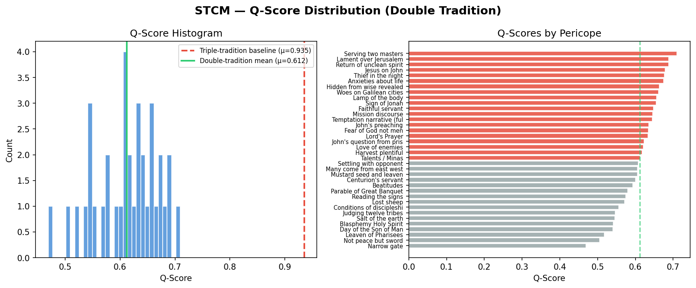

# STCM — Synoptic Transform Calibration Model

> A supervised source-reconstruction approach to the Synoptic Problem
> using embedding-space geometry and calibrated transform signatures.

📖 **[Documentation & Interactive Results](https://agnieszkachr.github.io/stcm/)**

## Overview

STCM is a computational research tool that investigates the **Synoptic Problem** — the literary relationship among the three synoptic gospels (Matthew, Mark, Luke) — through NLP embedding analysis.

The core hypothesis under test: **do the double-tradition pericopes (passages found in Matthew and Luke but absent from Mark) exhibit an embedding-space signature consistent with derivation from a shared written source (the hypothetical Q document)?**

### Method

1. **Calibration** — Embed triple-tradition pericopes (Matt + Mark + Luke) with [Ancient-Greek-BERT](https://huggingface.co/pranaydeeps/Ancient-Greek-BERT). Compute cosine similarity distributions (Signature A) and residual-vector correlations (Signature B) to establish baselines for known source-sharing.

2. **Scoring** — For each double-tradition pericope, compute a composite Q-score measuring how well the Matt–Luke embedding relationship matches the calibrated signatures.

3. **Reconstruction** — Estimate latent Q embeddings via iterative, ridge-regularised centroid-shrinkage convergence.

4. **Evaluation** — Random and thematic-null permutation tests, weight sensitivity analysis, sentence-level bootstrap robustness, word-overlap baseline comparison, Goulder redaction test, and internal BERT validation on known NT paraphrases.

### Key Results

| Metric | Value |
|--------|-------|
| Embedding model | `pranaydeeps/Ancient-Greek-BERT` |
| Triple-tradition calibration (Sig-A) | μ = 0.935, σ = 0.038 |
| Residual signature (Sig-B) | μ = 0.370, σ = 0.181 |
| Double-tradition Q-score mean | 0.612 ± 0.057 |
| Random permutation test | empirical *p* = 0.001 (0/1,000 ≥ observed) |
| Thematic-null permutation test | empirical *p* = 0.001 (0/1,000 ≥ observed) |
| Weight sensitivity (top-5 Jaccard) | 0.815 across 9 schemes |
| Sentence-level bootstrap std | 0.044 |
| Reconstruction convergence | 100% |

**Top 5 Q-scored pericopes:**

1. Serving Two Masters (Q = 0.710)
2. Lament over Jerusalem (Q = 0.689)
3. Return of Unclean Spirit (Q = 0.688)
4. Jesus on John (Q = 0.679)
5. Thief in the Night (Q = 0.677)



## Quickstart

```bash
# 1. Clone and enter the repo
cd stcm

# 2. Create venv and install dependencies (uv)
uv venv
uv pip install -r requirements.txt
# (or with pip: pip install -r requirements.txt)

# 3. Download SBLGNT source texts
python download_sblgnt.py

# 4. Run the full pipeline
python run_pipeline.py

# 5. Run with evaluation (permutation tests + robustness suite)
python run_pipeline.py --resume

# 6. Skip evaluation for speed
python run_pipeline.py --skip-eval
```

### Output files

```
outputs/
├── figures/
│   └── q_score_histogram.png        # Distribution visualisation
├── models/
│   ├── calibration_signatures.pkl    # Calibrated signatures
│   └── reconstructed_q_embeddings.pkl
└── reports/
    ├── evaluation_summary.md         # Full evaluation suite results
    ├── q_score_distribution.csv      # Per-pericope scores (all 36)
    └── system_validation.txt         # System report
```

## Architecture

```
stcm/
├── stcm/
│   ├── __init__.py        # Package metadata
│   ├── config.py          # Configuration with env-var overrides
│   ├── utils.py           # Greek normalisation, SBLGNT parsing, math helpers
│   ├── data_loader.py     # SBLGNT loader + Aland pericope alignment table
│   ├── embeddings.py      # Ancient-Greek-BERT + n-gram fallback pipeline
│   ├── calibration.py     # Triple-tradition signature computation
│   ├── scoring.py         # Double-tradition Q-score computation
│   ├── reconstruction.py  # Latent Q embedding estimation
│   └── evaluation.py      # Full robustness evaluation suite
├── site/                  # Markdown source files for MkDocs
├── docs/                  # Generated HTML site for GitHub Pages
├── run_pipeline.py        # End-to-end pipeline runner (resumable)
├── download_sblgnt.py     # SBLGNT data downloader
├── mkdocs.yml             # MkDocs configuration
├── tests/
│   └── test_pipeline.py   # 51-test suite
└── data/raw/              # Downloaded SBLGNT texts
```

## Configuration

All settings can be overridden via environment variables with the `STCM_` prefix:

```bash
# Use a different embedding model
STCM_EMBEDDING_MODEL=bert-base-multilingual-cased python run_pipeline.py

# Change log level
STCM_LOG_LEVEL=DEBUG python run_pipeline.py
```

## Methodology

### Signature A — Independent Tradition Baseline

For each triple-tradition pericope (n = 49), we compute `cos(emb(Matt), emb(Luke))`. This yields a distribution of expected Matt–Luke similarities when both evangelists share a common Markan source. The calibrated mean (0.935) and 95% CI [0.924, 0.945] define the expected similarity range.

### Signature B — Residual Dependence

The residual of Matthew relative to Mark captures what Matthew *adds* beyond the Markan template. If Matthew and Luke independently used Q in addition to Mark, their residuals should correlate. The calibrated mean residual cosine similarity is 0.370, indicating moderate but noisy correlation.

For double-tradition pericopes (where Mark is absent), the residual is computed relative to the **Mark centroid** — the mean embedding of all Mark's triple-tradition pericopes. This centroid represents the typical direction of synoptic narrative as shaped by Mark in embedding space. This is an approximation; see the article for full discussion of its implications.

### Q-Score Composition

```
Q-score = 0.5 × cos(Matt, Luke)
        + 0.3 × max(0, deviation_from_Sig_A)
        + 0.2 × max(0, residual_similarity)
```

This composite balances raw similarity (most important), deviation above the calibrated baseline (bonus for pericopes more similar than typical triple-tradition pairs), and residual correlation (signal of shared non-Markan content).

A **sensitivity analysis** across nine alternative weighting schemes (from equal weights to single-component models) confirms that the top-scoring pericopes remain highly stable regardless of parametrisation.

### Reconstruction

Latent Q embeddings are estimated by an iterative, ridge-regularised centroid-shrinkage algorithm. For each pericope, the calibrated residual transforms are stripped from the Matthew and Luke embeddings, and a weighted centroid (including the previous estimate as a shrinkage regulariser) converges to a stable latent position. All 36 pericopes converge within tolerance (1e-6) in ≤ 100 iterations.

## Evaluation Suite

The evaluation module (`stcm/evaluation.py`) performs eight analyses:

1. **Random permutation test** — Tests whether correctly paired Matt–Luke pericopes produce higher Q-scores than random pairings (empirical *p* = 0.001, 1,000 permutations).
2. **Top-10 permutation test** — As above, for the ten highest-scoring pericopes.
3. **Thematic-null permutation test** — A more demanding null that pairs each Matthean pericope with a *thematically similar* Lukan pericope (wisdom with wisdom, apocalyptic with apocalyptic, etc.), controlling for the possibility that topical overlap alone inflates similarity. Signal remains significant (empirical *p* = 0.001).
4. **Weight sensitivity analysis** — Recomputes Q-scores under nine alternative weighting schemes; reports top-5 Jaccard stability.
5. **Sentence-level bootstrap** — Resamples sentences within each pericope (200 resamples) to measure robustness to input perturbation.
6. **Word-overlap comparison** — Correlates embedding Q-scores with word-level Jaccard coefficients to demonstrate that embeddings capture information beyond lexical overlap.
7. **Goulder redaction test** — Compares Q-score distributions of pericopes Goulder (1989) identifies as demonstrating Lukan redaction of Matthew against the remainder. The test is underpowered at current sample sizes; the medium effect size (Cohen's *d* = −0.571) leaves the result genuinely inconclusive.
8. **Internal BERT validation** — Tests model calibration on known NT paraphrases (expected high similarity) vs. unrelated passages (expected low similarity).

## Falsifiability

This model is explicitly falsifiable on six criteria:

1. **If the random permutation test p-value is ≥ 0.05** → signal indistinguishable from random pairing.
2. **If the thematic-null permutation test p-value is ≥ 0.05** → signal attributable to topical similarity alone.
3. **If Signature B residual similarity is near zero** → no evidence of shared non-Markan content.
4. **If reconstruction fails to converge** → model inappropriate for this embedding space.
5. **If the sensitivity analysis shows unstable top-5 rankings** → results are weight-dependent.
6. **If the word-overlap correlation approaches 1.0** → embeddings add nothing beyond traditional concordance work.

## Limitations

- The model tests *consistency* with the Q hypothesis, not *truth*. A high Q-score does not prove Q exists — it shows the embedding geometry is what we'd expect if Q existed.
- Signature B is weakly grounded: no confirmed case of Matthew→Luke dependency exists for calibration. The Mark centroid used for double-tradition residuals is a global average, not a pericope-specific proxy. Moreover, because Mark's triple-tradition material is overwhelmingly narrative whilst the double tradition is predominantly discourse/sayings, comparing discourse material to a narrative baseline may artificially inflate residuals.
- "Inverse transform" is a regularised approximation, not a true mathematical inverse; 100% convergence is expected on mathematical grounds for centroid computation in high-dimensional space.
- Results depend on the embedding model's capture of Ancient Greek semantics. Internal validation confirms adequate calibration for NT Greek, but the model's training corpus is dominated by classical Attic prose.
- The pericope alignment table is a representative subset of the Aland Synopsis, not exhaustive.
- The sample size (36 double-tradition, 49 triple-tradition pericopes) constrains statistical power for sub-group analyses such as the Goulder redaction test.

## Data Source

Greek text: [SBLGNT](https://github.com/LogosBible/SBLGNT) (SBL Greek New Testament), released under the [SBLGNT EULA](https://www.sblgnt.com/license/). Used for research purposes.

## Citation

```bibtex
@software{stcm2026,
  title  = {STCM: Synoptic Transform Calibration Model},
  year   = {2026},
  url    = {https://github.com/agnieszkachr/stcm},
  note   = {A supervised source-reconstruction approach to the Synoptic Problem}
}
```

## License

MIT — see [LICENSE](LICENSE).

## Reproducibility

All pipeline outputs are fully deterministic given:
- SBLGNT text files (downloaded via `download_sblgnt.py`)
- Ancient-Greek-BERT model weights (v1.0 from HuggingFace)
- Python 3.11+ with dependencies per `requirements.txt`
- Random seed 42 (default, configurable)

The n-gram fallback embedder produces identical results across all platforms without network access.
