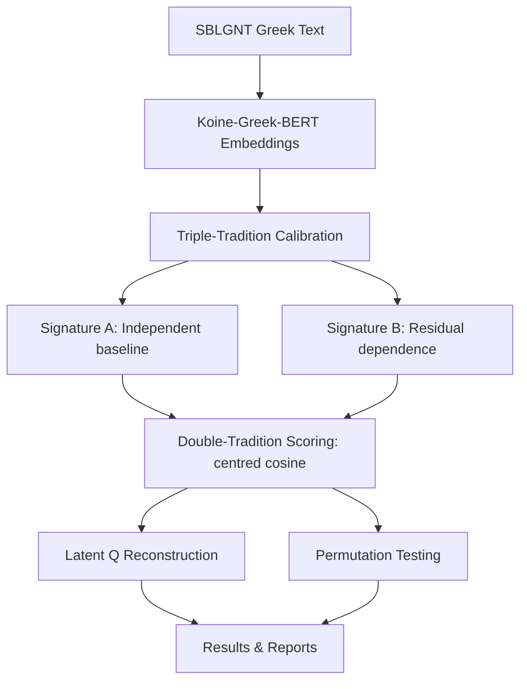

# STCM — Synoptic Transform Calibration Model

Welcome to the documentation for the **Synoptic Transform Calibration Model**, a computational research framework for investigating the Synoptic Problem through NLP embedding analysis.

## What is this?

STCM uses transformer-based embeddings of Ancient Greek text to test whether the *double-tradition* material (passages found in Matthew and Luke but absent from Mark) exhibits an embedding-space signature consistent with derivation from a shared written source — the hypothetical **Q document** (from German *Quelle*, "source").

## How does it work?

## Quick navigation

- **[Theoretical Framework](theoretical-framework.md)** — The Synoptic Problem and the Q hypothesis
- **[Methodology](methodology.md)** — Mathematical formulation and pipeline design
- **[Installation](installation.md)** — Setup instructions
- **[Usage](usage.md)** — Running the pipeline
- **[Results](results.md)** — Findings and interpretation
- **[FAQ](faq.md)** — Common questions
