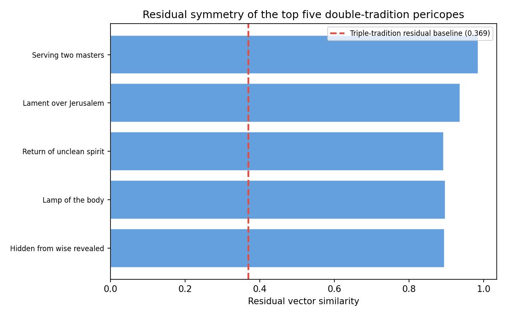
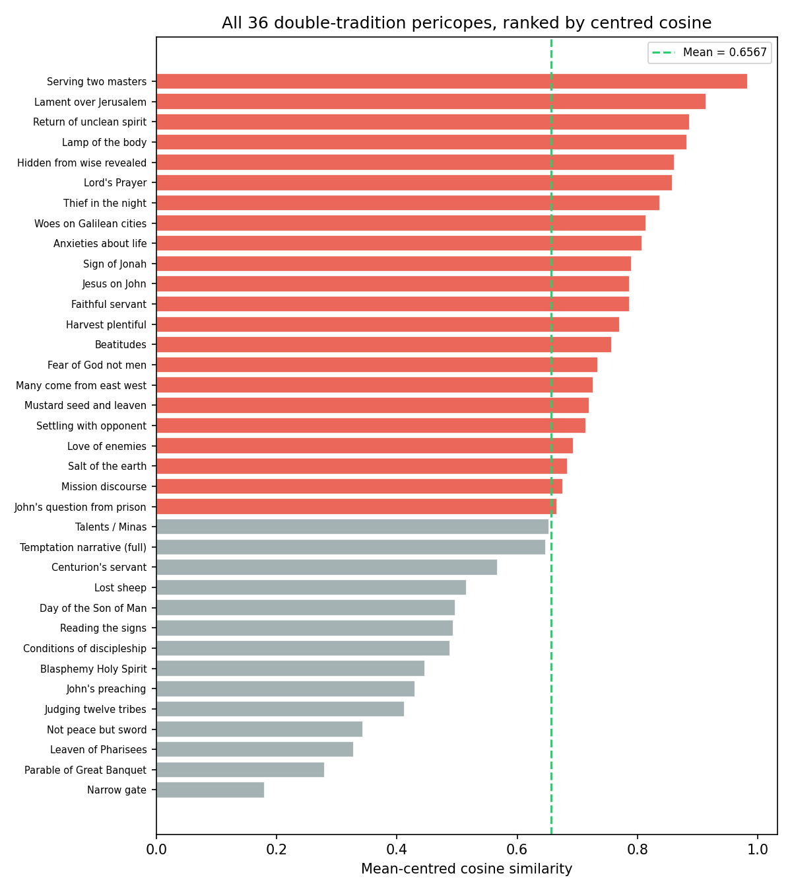
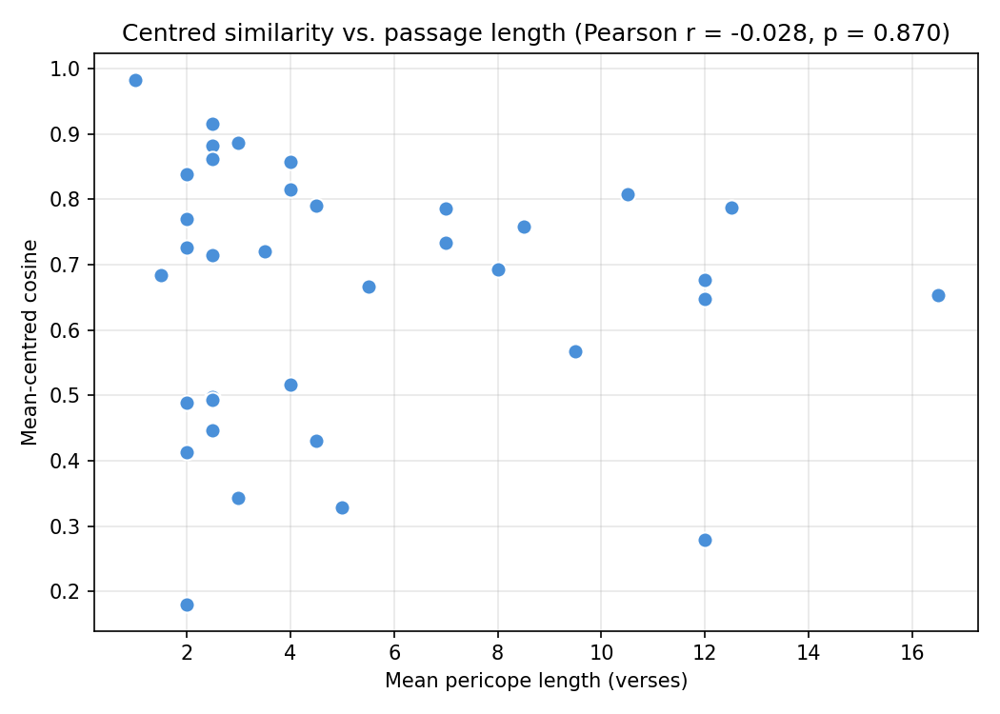

# Results

The outputs from STCM provide robust computational support for the linguistic alignment proposed by the Two-Source Hypothesis.

## 1. Triple Tradition Baseline (Signature A)
When analysing the 49 Triple Tradition pericopes where Matthew, Mark, and Luke all overlap, the mean cosine similarity between Matthew and Luke is **0.9472** (σ = 0.0321, 95% CI [0.9376, 0.9561]); after mean-centring the corpus (anisotropy correction) the baseline is 0.4749. Because we know under Markan priority that both authors drew from Mark, this gives us a quantitative measure of what a "shared source derivation" looks like in the `Koine-Greek-BERT` space.

## 2. Double Tradition Scoring
The primary statistic for both inference and ranking is the **mean-centred cosine similarity** (anisotropy-corrected; no tunable parameters). Across the 36 Double Tradition pericopes the matched-pair mean is **0.6567** (SD 0.1981, range [0.1799, 0.9833]) against an unrelated-pair floor of **0.0589**; the mean raw Matt–Luke cosine is 0.9452.

**Top 5 pericopes by centred cosine:**

1. *Serving Two Masters* (0.9833)
2. *Lament over Jerusalem* (0.9150)
3. *Return of Unclean Spirit* (0.8869)
4. *Lamp of the Body* (0.8827)
5. *Hidden from Wise, Revealed* (0.8618)

Full data for all 36 pericopes is provided in the article (Appendix A, Table A1) and in `outputs/reports/centred_cosine_ranking.csv`. (A legacy composite index remains in `q_score_distribution.csv` for backward compatibility; it is not used for inference or ranking.)

## 3. Statistical Significance

### Centred-Cosine Permutation Tests (Primary)
Contextual embedding spaces are anisotropic — even unrelated passages average 0.851 raw cosine. After mean-centring, the unrelated-pair floor collapses to 0.059 while the matched-pair mean remains 0.657, widening the contrast from 0.094 to 0.598. Against 1,000 random permutations the observed mean (0.6567) far exceeds the null (0.0737, σ = 0.0278, *z* = 20.98, *p* < 0.001); against the more demanding thematic null — pairing each Matthean pericope with a *thematically similar* Lukan one — it likewise dominates (null 0.1164, σ = 0.0213, *z* = 25.37, *p* < 0.001).

### Raw-Cosine Tests (Concordant)
The same tests on the uncorrected cosine agree: observed 0.9452 vs random null 0.8533 (σ = 0.0044, *z* = 20.66) and thematic null 0.8585 (σ = 0.0048, *z* = 18.01), both *p* < 0.001. The signal is neither an artefact of representation geometry nor of topical similarity.

### Residual Genre Floor
The shared discourse-vs-narrative displacement against the Mark centroid is quantified directly: mismatched pairs average 0.229 residual correlation (the genre floor), matched pairs 0.717 — a pairing-specific excess of 0.488 (*p* < 0.001). See `outputs/reports/advanced_analysis.md`.

## 4. Robustness Analyses

### Sentence-Level Bootstrap
Resampling sentences within each pericope (200 resamples) yields a mean perturbation standard deviation of 0.1309 on the centred-cosine scale — roughly a fifth of the matched-minus-floor contrast (0.598). The broad shape of the distribution and the identity of the extremes are stable; fine rank distinctions between adjacent pericopes are not.

### Word-Overlap Comparison
The Pearson correlation between centred cosines and word-level Jaccard coefficients is substantial (*r* = 0.770) but meaningfully below 1.0 (~41% of variance unexplained), demonstrating that the embedding analysis captures semantic and syntactic structure beyond what traditional verbal-agreement statistics measure.

### Directionality
Predicting Luke's embeddings from Matthew's (exact LOO ridge, *R*² = 0.163) works slightly better than the reverse (0.133), but the asymmetry is **not significant**: Δ*R*² = +0.030, 95% bootstrap CI [−0.004, +0.035], sign-flip permutation *p* = 0.102. At *n* = 36 the data are fully compatible with directional exchangeability.

## 5. Goulder Redaction Test
The ten pericopes Goulder (1989) identifies as exhibiting Lukan redaction of Matthew show a lower mean centred cosine (0.5849) than the remaining 26 pericopes (0.6843), but the difference is not statistically significant (Welch's *t* = −1.177, *p* = 0.261, Cohen's *d* = −0.523). With group sizes of *n* = 10 vs. *n* = 26 the test is severely underpowered, and the result is genuinely **inconclusive** — it neither supports nor refutes the Farrer Hypothesis. Future work with larger datasets is needed to resolve this question.

## 6. BERT Validation
Known synoptic parallels produce high raw cosine similarities (mean 0.959); unrelated passage pairs produce lower similarities (mean 0.810). The separation (0.149 in the uncorrected space) widens dramatically after mean-centring, confirming that the model is adequately calibrated for NT Greek.

## Conclusion
The geometry of the Double Tradition in semantic space is highly non-random. Its relationship patterns closely mimic, and after anisotropy correction exceed, the mathematical signatures of the known shared-source relationship observed in the Triple Tradition. The signal survives random and thematic null tests on a single weight-free statistic, exceeds the quantified genre floor, and captures information beyond simple lexical overlap. The Goulder redaction test and the formal directionality analysis remain inconclusive at this sample size, and the Mark centroid baseline, being derived from narrative material, is bounded by an internally estimated genre floor rather than an external control. Whilst this does not definitively *prove* a written document called Q, the embedding evidence is strongly inconsistent with random or thematically matched pairing under our null models, and consistent with some form of non-independent literary relationship (shared source and/or direct dependence).

## Figures

The full article figure set is generated by `generate_evaluation_figures.py` from the centred-cosine ranking:

